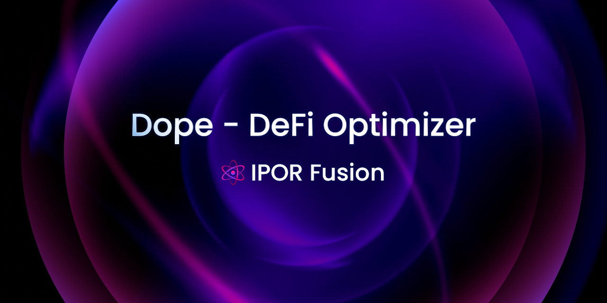

# Dope - Defi Optimizer

# Introduction

Dope is a backtesting engine for DeFi, focusing on lending markets, yield protocols and RWAs.

[](https://github.com/IPOR-Labs/dope)


Some of the common use cases of Dope are:

- Quickly load historical data of yielding pools;
- Out-of-the-box slippage models; 
- Running backtests on predefined strategies, such as: 
    - Yield optimization, 
    - Looping rates arbitrage,
    - And more;
- Designing your custom strategies;
- Analyzing backtest results and comparing them with your existing portfolio:
    - Portfolio Optimization tools

# real World Assets (RWAs) Pricing

`Dope` supports RWA pricing.

See this notebook for a few examples: [notebooks/RWA Pricer Examples.ipynb](https://github.com/IPOR-Labs/dope/blob/main/notebooks/RWA%20Pricer%20Examples.ipynb)

See whitepaper here: [research/rwa-pricer.pdf](https://github.com/IPOR-Labs/dope/blob/main/research/rwa-pricer.pd)

# Backtesting and Yield Optimization

Look at the [notebooks](https://github.com/IPOR-Labs/dope/tree/main/notebooks) folder for a few tutorials.

For a simple backtest example look at [[Tutorial] Simple Backtest.ipynb](https://github.com/IPOR-Labs/dope/blob/main/notebooks/%5BTutorial%5D%20Simple%20Backtest.ipynb)

# Install Dope locally:

```bash
pip install -e .
```

# Dope Presentation

https://www.youtube.com/watch?v=cvHyZqs4Nt4
